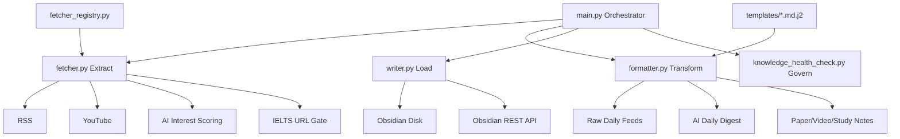

# Obsidian Workflow Open

> 面向 Obsidian 的本地优先（Local-First）知识工程流水线。
>
> 用工程化方式实现每日闭环：**采集 -> 过滤 -> 结构化 -> 写入 -> 治理**。

[](https://github.com/haoran3160-afk/pkm_obsidian_workflow/actions/workflows/ci.yml)
[](https://github.com/haoran3160-afk/pkm_obsidian_workflow/actions/workflows/docs.yml)
[](https://www.python.org/)
[](LICENSE)

---

## 项目定位

`obsidian_workflow_Open` 不是“资讯爬虫脚本”，而是一个可持续迭代的 PKM（Personal Knowledge Management）工程系统。

它解决三类长期问题：

1. 输入质量差：信息很多，但真正有迁移价值的方法很少。
2. 输出质量不稳：笔记格式、元数据、来源记录容易漂移。
3. 知识库退化：孤儿笔记、幽灵链接、过期内容长期积累。

---

## 设计哲学（Karpathy 架构参考）

本项目参考了 Karpathy 式的“LLM + Wiki”实践路径，核心是把知识处理拆成可复用环节：

1. **Raw Context First**：先完整保留原始信息，不在最前面过早筛掉上下文。
2. **Agent/LLM Curation**：在中间层做打分、聚类、分桶与摘要。
3. **Promote to Durable Notes**：把经过审核的内容沉淀为可复利的长期笔记。
4. **Governance by Default**：常态化健康检查，防止知识库熵增。

在本仓库里，分别对应：

- `--raw-only` 生成 Agent 可消费原始日报
- AI 兴趣评分与固定分桶（前沿技巧 / 工程实践 / 工具链更新）
- Obsidian 写入链路（disk / api / both）
- `knowledge_health_check.py` 健康治理

---

## 核心优势

1. **高信噪比信息输入**
   - 支持 AI 资讯兴趣评分模型：`min_ai_interest_score`、优先词、兴趣词、排除词。
   - 默认偏向可实践的方法论，不偏“纯新闻噪音”。

2. **IELTS 来源可访问性保障**
   - 支持域名白名单 + URL 可访问性检查。
   - 避免“推荐了但打不开”的无效内容。

3. **Raw -> Curated 双层工作流**
   - 先保留 raw feed，再进行 Agent 二次整理。
   - 既保上下文，又保证最终输出质量。

4. **严格 ETL 分层**
   - Fetch / Format / Write 三层解耦，便于测试与扩展。

5. **Obsidian 原生集成**
   - 支持本地文件写入、REST API 写入、双写模式。
   - `pkm_bridge.py` 支持外部入口式笔记写入。

6. **模板驱动的一致输出**
   - Jinja2 模板统一 frontmatter 与正文结构。
   - 显著降低笔记风格漂移。

7. **知识库治理内建**
   - 可检测 frontmatter 缺失、无来源、孤儿页、幽灵链接、陈旧页、单向链接等问题。

8. **开源工程规范完整**
   - CI、Ruff、Mypy、Pytest、Coverage、SECURITY、Contributing、Issue/PR 模板齐全。

---

## 架构总览



---

## 项目结构（当前仓库）

```text
obsidian_workflow_Open/
├─ .agent/workflows/                # Agent 工作流（日报/周报/提交）
├─ .github/
│  ├─ workflows/                    # CI + Docs Deploy
│  ├─ ISSUE_TEMPLATE/
│  └─ pull_request_template.md
├─ docs/                            # MkDocs 文档源文件
├─ templates/                       # Jinja2 模板
├─ tests/                           # 测试用例
├─ main.py                          # 编排入口 / CLI
├─ fetcher.py                       # 信息抓取 + 质量过滤
├─ formatter.py                     # Markdown 渲染
├─ writer.py                        # Vault 写入适配层
├─ config_schema.py                 # Pydantic 配置校验
├─ fetcher_registry.py              # 来源扩展注册器
├─ pkm_bridge.py                    # 外部入口写入桥接
├─ knowledge_health_check.py        # 知识库健康检查
├─ pkm_config.json                  # 主配置
├─ requirements.txt
├─ requirements-dev.txt
├─ pyproject.toml                   # ruff/mypy/pytest/coverage 配置
└─ README.md
```

---

## 快速开始

### 1. 环境要求

- Python 3.10+
- Obsidian
- （可选）Obsidian Local REST API 插件

### 2. 安装

```bash
git clone https://github.com/haoran3160-afk/pkm_obsidian_workflow.git
cd pkm_obsidian_workflow
pip install -r requirements.txt
```

### 3. 初始化配置

Unix/macOS:

```bash
cp .env.example .env
```

Windows PowerShell:

```powershell
Copy-Item .env.example .env
```

最少配置项：

```dotenv
OBSIDIAN_VAULT_PATH=D:/path/to/your/Obsidian
```

然后编辑 `pkm_config.json` 配置你的信息源与质量阈值。

### 4. 预检

```bash
python main.py --doctor
```

### 5. 运行

```bash
# 正常日抓取
python main.py

# 仅生成 raw 日报（给 Agent 二次整理）
python main.py --raw-only

# 仅预览写入，不真正落盘
python main.py --dry-run

# 执行知识库健康检查
python main.py --health-check
```

---

## 命令总览

| 命令 | 作用 |
|---|---|
| `python main.py` | 执行日抓取并写入 |
| `python main.py --raw-only` | 输出原始日报，供 Agent 策展 |
| `python main.py --dry-run` | 只显示将写入文件，不执行 I/O |
| `python main.py --test` | 测试模式（不写入 Vault） |
| `python main.py --schedule` | 常驻调度模式 |
| `python main.py --doctor` | 运行配置与依赖诊断 |
| `python main.py --doctor-skip-network` | 跳过网络检查的诊断 |
| `python main.py --health-check` | 生成知识库健康报告 |

---

## 结果质量控制（重点参数）

以下参数在 `pkm_config.json` 中配置：

| 参数 | 作用 |
|---|---|
| `min_ai_interest_score` | AI 内容最低保留分数 |
| `max_ai_items_per_feed` | 限制单来源占比 |
| `ai_interest_topics` | 中权重兴趣词 |
| `ai_priority_topics` | 高权重优先词 |
| `ai_exclude_keywords` | 降权噪声词 |
| `validate_ielts_urls` | 是否做 IELTS 链接可访问检查 |
| `ielts_accessible_domains` | IELTS 可用域名白名单 |
| `used_articles_retention_days` | 去重记忆窗口 |
| `source_health_keep_runs` | 来源健康历史保留轮次 |

---

## 写入模式

`write_mode` 可选：

- `disk`：直接写本地 Vault
- `api`：通过 Obsidian Local REST API 写入
- `both`：双写（迁移/校验场景）

---

## 如何扩展信息源

在 `fetcher_registry.py` 中注册新来源类型：

```python
from fetcher_registry import register_fetcher

@register_fetcher("reddit")
def fetch_reddit(config: dict, cache: dict, today: str, **kwargs) -> list[dict]:
    return [{"title": "...", "link": "...", "guid": "...", "summary": "...", "folder": "..."}]
```

然后在 `pkm_config.json` 中为该来源设置 `type: "reddit"`。

---

## 知识库健康治理

`knowledge_health_check.py` 默认检查：

- frontmatter 必填字段缺失
- 无来源页面
- 孤儿页面
- 幽灵 wikilink
- 长期未更新页面
- 单向链接 / 薄来源页面

默认输出：

- `40-MOC/lint-report-YYYY-MM-DD.md`
- 可选追加到 `40-MOC/log.md`

---

## 工程质量标准

- Lint：Ruff
- Type Check：Mypy
- Test：Pytest
- Coverage：CI 强制阈值
- CI：`.github/workflows/ci.yml`
- Docs Deploy：`.github/workflows/docs.yml`

本地质量检查：

```bash
pip install -r requirements-dev.txt
ruff check .
ruff format --check .
mypy main.py fetcher.py formatter.py writer.py config_schema.py --ignore-missing-imports
pytest --cov=. --cov-report=term-missing -q
```

---

## 安全与隐私

- `.env` 默认被忽略，不应提交。
- API Key 仅本地保存。
- 发布前请阅读 [SECURITY.md](SECURITY.md)。

---

## 文档入口

- [Quickstart](docs/quickstart.md)
- [Plugin Guide](docs/plugins.md)
- [Docs Index](docs/index.md)

---

## 贡献

- 请先阅读 [CONTRIBUTING.md](CONTRIBUTING.md)
- 使用 `.github` 下的 Issue/PR 模板提交问题与改动

---

## 许可证

MIT License，见 [LICENSE](LICENSE)。
