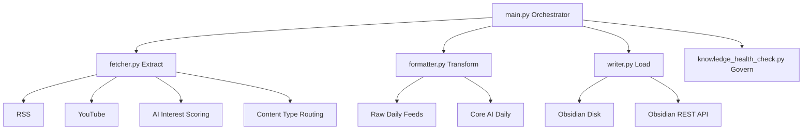

#  PKM Obsidian Workflow

> 一个面向 AI 信息摄入与知识沉淀的 Obsidian 本地优先工作流。
> 目标不是“抓更多”，而是“每天只产出一份高密度、可执行、可沉淀的核心日报”。

[](https://github.com/haoran3160-afk/pkm_obsidian_workflow/actions/workflows/ci.yml)
[](https://github.com/haoran3160-afk/pkm_obsidian_workflow/actions/workflows/docs.yml)
[](https://www.python.org/)
[](LICENSE)

---

## 为什么这个项目值得用

大多数“资讯 -> 笔记”流程会在三个地方失效：

1. 输入层：来源很多，但噪声更大。
2. 加工层：摘要看似丰富，但缺乏可执行结论。
3. 沉淀层：每天产出太多碎片，最后无人回看。

`pkm_obsidian_workflow` 的设计原则是：

- **少而精**：默认只输出一份核心 `AI Daily`。
- **可执行**：日报内直接包含“提炼任务”和行动入口。
- **可沉淀**：保留 Raw 证据链，支持后续复盘与二次加工。
- **本地优先**：默认写入本地 Obsidian Vault，数据资产可控。

---

## 架构灵感（Karpathy 知识库架构）

把知识库当作一个持续迭代的系统，而不是一次性产出的文档集合。

### 设计哲学（First Principles）

1. **知识是“压缩链”，不是“堆积场”**
   先做高保真采集（保留原始上下文），再做逐层压缩（摘要、分类、结论），最后转成可执行动作（任务、实验、决策）。
2. **上下文优先于结论**
   结论必须可回溯到来源，避免“只剩观点、没有证据”。这对 AI 时代尤为关键，可降低幻觉摘要对长期知识库的污染。
3. **决策效率优先于文件数量**
   目标不是每天生成更多笔记，而是让你在固定时间内读完、理解并做出行动选择。
4. **治理能力是默认配置**
   知识库天然会熵增。去重、结构约束、健康检查要内建在流程中，而不是靠事后人工救火。

### 设计哲学：五层闭环（Capture -> Filter -> Curate -> Promote -> Govern）

1. **Capture（采集层）**
   以“尽量无损”方式接收信息：来源、标题、链接、发布时间、上下文都保留，先不做过早删减。
2. **Filter（过滤层）**
   用兴趣评分、优先词、排除词、去重和限流，把“信息流”变成“候选集”，控制每日认知负载。
3. **Curate（策展层）**
   将候选集聚合到单一核心 `AI Daily`，并按 `资讯 / 推文 / 工程实践 / 论文 / 视频` 分区，形成统一阅读界面。
4. **Promote（沉淀层）**
   只把高价值条目升级为长期笔记（如专题、MOC、行动清单），避免“每条输入都沉淀”导致库内膨胀。
5. **Govern（治理层）**
   持续执行知识库健康检查，修正链接失效、结构漂移和重复内容，让系统长期保持可维护性。

### 在本项目中的映射

- `python main.py --raw-only`：Raw Context First，保留证据层与回溯能力
- `fetcher.py`：评分、去重、分类、限流（Filter）
- `formatter.py`：生成单一核心 `AI Daily` 并统一分区（Curate）
- `daily_digest_only_output=true`：默认高信噪比单输出，避免信息碎片化
- `knowledge_health_check.py`：结构治理与长期质量维护（Govern）

这套哲学的核心不是“自动化越多越好”，而是“在最小认知负担下，把外部信息转成可执行知识”。

---

## 核心优势

- **单一核心输出（默认）**：`daily_digest_only_output = true`，避免信息过载。
- **统一视图**：同一日报聚合 `AI资讯 / 推文速览 / 工程实践 / 论文雷达 / 视频速览`。
- **质量过滤**：兴趣评分、优先词、噪声词、去重、限流。
- **双层工作流**：Raw 原始层 + Curated 核心层，可追溯且可回放。
- **Obsidian 原生**：支持本地写入、REST API 写入、双写模式。
- **工程化质量保障**：测试、静态检查、CI、文档部署齐备。

---

## 系统结构



---

## 目录结构

```text
obsidian_workflow_open/
├─ .agent/workflows/                  # Agent 工作流模板
├─ docs/                              # 文档
├─ templates/                         # Markdown 模板
├─ tests/                             # 测试
├─ main.py                            # 编排入口
├─ fetcher.py                         # 抓取与打分
├─ formatter.py                       # 日报/笔记渲染
├─ writer.py                          # 写入适配（disk/api）
├─ config_schema.py                   # Pydantic 配置校验
├─ pkm_bridge.py                      # 外部写入桥接
├─ knowledge_health_check.py          # 知识库健康检查
├─ pkm_config.json                    # 主配置
└─ README.md
```

---

## 快速开始

### 1) 环境要求

- Python 3.10+
- Obsidian
- （可选）Obsidian Local REST API 插件

### 2) 安装

```bash
git clone https://github.com/haoran3160-afk/pkm_obsidian_workflow.git
cd pkm_obsidian_workflow
pip install -r requirements.txt
```

### 3) 配置

复制环境变量模板：

- macOS/Linux: `cp .env.example .env`
- PowerShell: `Copy-Item .env.example .env`

设置最小必要项：

```dotenv
OBSIDIAN_VAULT_PATH=D:/path/to/your/Obsidian
```

编辑 `pkm_config.json` 配置数据源与阈值。

### 4) 运行前诊断

```bash
python main.py --doctor
```

### 5) 运行

```bash
# 正常运行：写入核心日报
python main.py

# 仅生成 Raw 原始日报（供 Agent/人工二次策展）
python main.py --raw-only

# 预览将写入内容，不执行 I/O
python main.py --dry-run

# 测试模式（不写入 Vault）
python main.py --test

# 生成知识库健康报告
python main.py --health-check
```

---

## 输出产物

- `00-Inbox/Raw-Feeds/Raw-Daily-Feeds-YYYY-MM-DD.md`
- `30-Daily/AI-News/AI-Daily-YYYY-MM-DD.md`
- `40-MOC/lint-report-YYYY-MM-DD.md`

示例可见：

- [AI Daily Sample](docs/sample_outputs/ai-daily-brief-sample.md)
- [Paper Note Sample](docs/sample_outputs/paper-note-sample.md)
- [Video Note Sample](docs/sample_outputs/video-note-sample.md)

---

## 配置重点（pkm_config.json）

| 参数 | 说明 |
|---|---|
| `daily_digest_only_output` | 是否仅输出单一核心日报（推荐 `true`） |
| `daily_digest_top_picks` | 日报 Top Picks 上限 |
| `daily_digest_max_items_per_source` | 每来源展示上限 |
| `daily_digest_action_items` | 提炼任务数量 |
| `daily_digest_include_mindmap` | 是否输出 Mermaid 思维导图 |
| `daily_digest_include_cognitive_lenses` | 是否输出 Karpathy 视角的“认知增量”区块 |
| `daily_digest_cognitive_questions` | 认知评估问题列表（可按你的策略自定义） |
| `min_ai_interest_score` | AI 内容最低保留分 |
| `max_ai_items_per_feed` | 单来源占比限制 |
| `max_paper_notes_per_day` | 每日纳入论文条目上限 |
| `max_video_notes_per_day` | 每日纳入视频条目上限 |
| `ai_interest_topics` | 中权重兴趣词 |
| `ai_priority_topics` | 高权重优先词 |
| `ai_exclude_keywords` | 噪声降权词 |

### `content_type` 分类

RSS 项可配置 `content_type`，用于核心日报统一分区：

- `news`
- `tweet`
- `engineering`
- `paper`
- `video`
- `tooling`
- `community`
- `other`

---

## 推荐工作方式

1. 每天先跑 `python main.py --raw-only`。
2. 审核 Raw 后跑 `python main.py` 生成核心日报。
3. 从“提炼任务（可执行）”里挑 1-3 条做深度笔记。
4. 每周跑 `python main.py --health-check` 做结构治理。

---

## 工程质量与安全

本地建议执行：

```bash
pip install -r requirements-dev.txt
ruff check .
ruff format --check .
mypy main.py fetcher.py formatter.py writer.py config_schema.py --ignore-missing-imports
pytest --cov=. --cov-report=term-missing -q
```

## 路线图（Roadmap）

- 更强的“多源去重 + 主题聚合”
- 推文线程级摘要与观点冲突检测
- 周报/月报自动生成与回顾模板
- 深度笔记自动升级（从日报任务到永久笔记）
- 更完整的插件生态（来源、模板、评分器）

---

## 贡献

欢迎 PR 与 Issue：

- [CONTRIBUTING.md](CONTRIBUTING.md)
- `.github/ISSUE_TEMPLATE`
- `.github/pull_request_template.md`

---

## 许可证

MIT License，见 [LICENSE](LICENSE)

---

## 给 Agent 的一键配置提示词

如果你希望让 Agent 直接把本项目配置在你的电脑上，把下面这段话原样发给 Agent：

```text
请在我的电脑上完整配置并验证 pkm_obsidian_workflow，要求端到端可运行。

目标：
1) 在本地创建并激活 Python 虚拟环境，安装 requirements.txt 与 requirements-dev.txt。
2) 检查并配置 .env（至少包含 OBSIDIAN_VAULT_PATH）。
3) 检查 pkm_config.json，确保 daily_digest_only_output=true，并保留 AI-only 数据源配置。
4) 运行 python main.py --doctor，修复所有阻塞问题。
5) 运行 python main.py --raw-only 与 python main.py，确保在 Vault 中生成：
   - 00-Inbox/Raw-Feeds/Raw-Daily-Feeds-YYYY-MM-DD.md
   - 30-Daily/AI-News/AI-Daily-YYYY-MM-DD.md
6) 核验日报必须是中文结构化输出，并包含分区：
   - AI资讯 / 推文速览 / 工程实践 / 论文雷达 / 视频速览
7) 运行 python main.py --health-check，并给出报告路径。
8) 最后输出：已修改文件列表、执行命令列表、关键结果摘要。

约束：
- 不要删除我的已有 Vault 内容。
- 不要提交或覆盖与本任务无关的文件。
- 如果遇到权限/网络问题，先给出最小修复方案，再继续执行。
```
