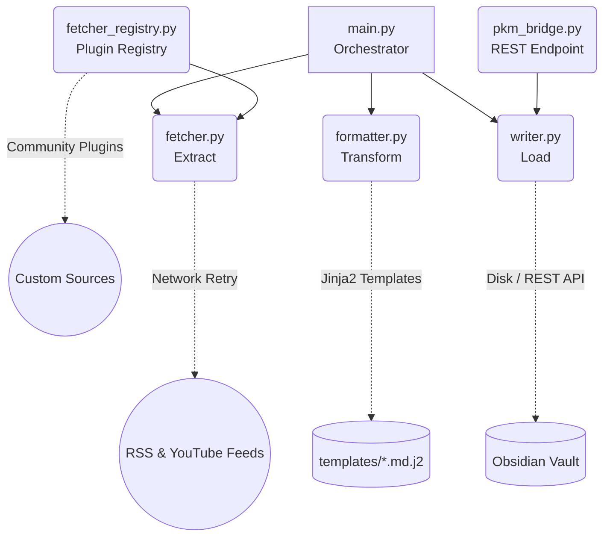

# Obsidian PKM Workflow

> **Your Local, AI-Ready Second Brain Pipeline.**

[](https://github.com/yourusername/obsidian_workflow_open/actions/workflows/ci.yml)
[](https://pypi.org/project/obsidian-pkm-workflow)
[](LICENSE)

An automated Personal Knowledge Management (PKM) workflow that aggregates daily news, AI research papers, and YouTube videos — routing them directly into your Obsidian Vault as pristine Markdown.

## Why use this project?

1. 🧠 **Your Offline Information Copilot**: Break free from "information scattering" anxiety. Build a high-signal, zero-code pipeline that streams RSS and YouTube directly into your PKM system.
2. 🤖 **An Agent-Ready Skeleton**: Purpose-built for the AI era. Natively supports generating "Raw Data Feeds" specifically designed to be easily processed by Dify, Coze, or local LLMs. Spend your time *connecting* knowledge, not *moving* it.
3. 🔒 **100% Data Sovereignty**: No expensive cloud services. No closed-source databases. All your fetched data rests safely as Markdown files in your local Obsidian Vault. Private, secure, and future-proof.
4. 🏗️ **Template-Driven Framework**: Obsidian workflows are highly personal. This framework delegates all Markdown styling to `Jinja2` templates. You have complete control over how your Notes, Tags, and Frontmatter look.
5. 🔌 **Plugin-Extensible**: Register custom data source fetchers (Reddit, Twitter, etc.) without modifying core code using the Source Plugin Registry.

---

## 🏗️ Architecture Stack

The project follows a strict **ETL (Extract, Transform, Load)** separation to ensure robustness and extensibility.



| Module | Role | Key Tech |
|--------|------|----------|
| `fetcher.py` | **Extract** — network requests | `feedparser`, `tenacity` |
| `formatter.py` | **Transform** — pure Markdown generation | `Jinja2` |
| `writer.py` | **Load** — Vault I/O | filesystem, REST API |
| `config_schema.py` | Config validation | `pydantic v2` |
| `fetcher_registry.py` | Plugin system | Strategy Pattern |

---

## 🚀 Getting Started

### Prerequisites

- **Python 3.10+**
- **Obsidian** (and the [Obsidian Local REST API Plugin](https://github.com/coddingtonbear/obsidian-local-rest-api) if using `write_mode: api`)

### 1. Installation

```bash
git clone https://github.com/yourusername/obsidian_workflow_open.git
cd obsidian_workflow_open

# Install dependencies
pip install -r requirements.txt

# (Optional) Install as editable package for global `pkm` command
pip install -e .
```

### 2. Configuration

```bash
# Copy the example environment file and edit it
cp .env.example .env
```

Edit `.env` with your Obsidian Vault path:
```dotenv
OBSIDIAN_VAULT_PATH=D:/path/to/your/Obsidian
```

Customize `pkm_config.json` to define RSS feeds, YouTube channels, and write mode.

For advanced personalization, tune these quality gates in `pkm_config.json`:
- `min_ai_interest_score`
- `max_ai_items_per_feed`
- `ai_interest_topics`
- `ai_priority_topics`
- `ai_exclude_keywords`
- `validate_ielts_urls`
- `ielts_accessible_domains`

### 3. Preflight Check

```bash
python main.py --doctor
```

### 4. Usage

| Command | Description |
|---------|-------------|
| `python main.py` | Fetch today's feeds into Vault |
| `python main.py --dry-run` | Preview files that would be written (no I/O) |
| `python main.py --raw-only` | Export raw feeds for AI Agent curation |
| `python main.py --test` | Test mode — no Vault writes |
| `python main.py --schedule` | Run as a daily daemon |
| `python main.py --doctor` | Config and connectivity diagnostics |
| `python main.py --health-check` | Run Obsidian knowledge health report |

Raw files are written to `00-Inbox/Raw-Feeds/Raw-Daily-Feeds-YYYY-MM-DD.md` and auto-archived after `RAW_FEED_KEEP_DAYS` days.

### 5. Write Modes

Set `write_mode` in `pkm_config.json` (or `PKM_WRITE_MODE` env var):

| Mode | Behavior |
|------|----------|
| `"disk"` (default) | Write directly to local Vault filesystem |
| `"api"` | Write via Obsidian Local REST API |
| `"both"` | Write to both disk and API simultaneously |

### 6. Testing

```bash
pip install -r requirements-dev.txt
pytest
```

---

## 🔌 Writing a Custom Source Plugin

```python
# my_reddit_plugin.py
from fetcher_registry import register_fetcher

@register_fetcher("reddit")
def fetch_reddit(config: dict, cache: dict, today: str, **kwargs) -> list[dict]:
    # Your implementation here
    return [{"title": "...", "link": "...", "guid": "...", "summary": "...", "folder": "..."}]
```

Then add to `pkm_config.json`:
```json
{ "rss_feeds": [{ "type": "reddit", "name": "r/MachineLearning", ... }] }
```

---

## 🛠️ Modifying Note Templates

Every output file is backed by a simple Jinja2 template. Edit any file in `/templates/` and the script will honor your personal PKM taxonomy.

---

## 🤝 Contributing

Contributions are highly welcome. See [CONTRIBUTING.md](CONTRIBUTING.md) for guidelines.

## 📄 Changelog

See [CHANGELOG.md](CHANGELOG.md) for the full version history.

## ⚖️ License

MIT License.
