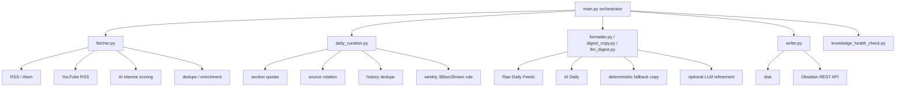

# PKM Obsidian Workflow

> 一个面向 AI 信息摄入、策展与沉淀的 Obsidian 本地优先工作流。  
> 目标不是“抓更多”，而是“每天只产出一份高信息密度、可执行、可回溯的 AI 日报”。

[](https://github.com/haoran3160-afk/pkm_obsidian_workflow/actions/workflows/ci.yml)
[](https://github.com/haoran3160-afk/pkm_obsidian_workflow/actions/workflows/docs.yml)
[](https://www.python.org/)
[](LICENSE)

---

## 为什么这个项目值得用

大多数“信息流 -> 笔记”的自动化，最后都会烂在三个地方：

1. 输入层很热闹，但真正有价值的信号被噪声淹没。
2. 总结层看起来很满，但没有形成可执行判断。
3. 沉淀层产出太碎，几天后自己都不会回看。

`pkm_obsidian_workflow` 的目标不是做一个抓取器，而是做一个本地优先、可回溯、可治理的 AI 日报系统：

- **少而精**：默认每天只写一份 `AI Daily`，而不是散落几十条半成品。
- **证据优先**：先保留 raw 证据，再做策展和摘要，避免“观点先行、证据缺位”。
- **可执行**：最终日报必须能转成行动，而不只是“知道了”。
- **可治理**：去重、来源轮换、健康检查、状态文件都内建在流程里。

---

## 架构灵感（Karpathy 式知识系统）

这个项目的底层哲学很简单：**把知识库当成一个持续迭代的系统，而不是一次性输出的文档集合。**

### 设计原则

1. **知识是压缩链，不是堆料场**  
   先做高保真采集，再做逐层压缩，最后转成行动。
2. **上下文优先于结论**  
   结论必须尽量可回溯到来源，避免“摘要幻觉污染知识库”。
3. **决策效率优先于笔记数量**  
   成功标准不是生成更多 Markdown，而是让你在固定时间内读完、判断、行动。
4. **治理能力必须内建**  
   去重、轮换、结构检查、健康报告应该是流程的一部分，而不是后处理。

### 五层闭环

1. **Capture**：尽量无损地接收 RSS、arXiv、YouTube 与外部源信息。
2. **Filter**：用兴趣评分、关键词、去重和限流把信息流收缩成候选集。
3. **Curate**：把候选集合并成一份固定结构的 `AI Daily`。
4. **Promote**：只把真正高价值内容升级为长期笔记或专题。
5. **Govern**：持续执行知识库健康检查，防止结构漂移。

### 在本项目中的映射

- `python main.py --raw-only`：保留原始证据层。
- `fetcher.py`：抓取、评分、去重、内容路由。
- `daily_curation.py`：栏目配额、来源轮换、历史去重、最终选题。
- `formatter.py`：把策展计划渲染成固定结构日报。
- `digest_copy.py`：不依赖外部 LLM 的稳定 fallback copy。
- `llm_digest.py`：可选的模型精修层，只负责最终 copy，不参与选题。
- `writer.py`：将 Markdown 写入本地 Vault 或 Obsidian REST API。
- `knowledge_health_check.py`：知识库治理与健康检查。

---

## 核心优势

- **单一核心输出**：默认 `daily_digest_only_output = true`，减少认知负担。
- **双阶段工作流**：`Raw` 与 `Curated` 分层明确，适合 Agent 和人工协同。
- **本地优先**：核心数据和产物都在你的 Obsidian Vault，不依赖云端托管。
- **策展而非拼模板**：最终日报由 `daily_curation.py` 决定结构与选题，而不是靠 formatter 硬凑。
- **稳定 fallback**：不开启模型精修也能产出完整日报，不会因为 API 配额而塌成空壳。
- **可审计状态**：`used_articles.json` 与 `source_rotation.json` 明确记录历史选择。
- **工程化完整**：Pydantic 配置校验、pytest、CI、日志、文档站都已齐全。

---

## 系统结构



---

## 目录结构

```text
obsidian_workflow_open/
├── .agent/workflows/                  # Agent 工作流模板
├── docs/                              # 项目文档与样例
├── templates/                         # Markdown 模板
├── tests/                             # 单元测试
├── main.py                            # 编排入口
├── fetcher.py                         # 抓取、评分、去重
├── daily_curation.py                  # 最终选题与状态管理
├── digest_copy.py                     # 稳定 fallback copy
├── llm_digest.py                      # 可选模型精修层
├── formatter.py                       # Raw 流 / 最终日报渲染
├── writer.py                          # 写入适配（disk / api）
├── config_schema.py                   # Pydantic 配置校验
├── knowledge_health_check.py          # 知识库健康检查
├── pkm_config.json                    # 主配置
└── README.md
```

---

## 快速开始

### 1) 环境要求

- Python 3.10+
- Obsidian
- 可选：Obsidian Local REST API 插件

### 2) 安装

```bash
git clone https://github.com/haoran3160-afk/pkm_obsidian_workflow.git
cd pkm_obsidian_workflow
pip install -r requirements.txt
```

### 3) 配置

复制环境变量模板：

- macOS/Linux：`cp .env.example .env`
- PowerShell：`Copy-Item .env.example .env`

最少必需配置：

```dotenv
OBSIDIAN_VAULT_PATH=D:/path/to/your/Obsidian
```

如果你希望启用模型精修层，而不是只使用 deterministic fallback，可以额外配置：

```dotenv
PKM_ENABLE_LLM_DIGEST_COPY=1
OPENAI_API_KEY=...
OPENAI_BASE_URL=
PKM_CURATION_MODEL=gpt-5.4-mini
PKM_CURATION_REASONING_EFFORT=medium
```

然后编辑 `pkm_config.json`，确认数据源、Vault 路径和阈值符合你的工作流。

### 4) 运行前诊断

```bash
python main.py --doctor
```

### 5) 运行

```bash
# 正常运行：生成最终日报
python main.py

# 只生成 Raw 证据流
python main.py --raw-only

# 预览将写入的内容，不执行 I/O
python main.py --dry-run

# 测试模式：不写入 Vault
python main.py --test

# 生成知识库健康报告
python main.py --health-check
```

---

## 输出产物

- `00-Inbox/Raw-Feeds/Raw-Daily-Feeds-YYYY-MM-DD.md`
- `30-Daily/AI-News/AI-Daily-YYYY-MM-DD.md`
- `40-MOC/lint-report-YYYY-MM-DD.md`

样例：

- [AI Daily Sample](docs/sample_outputs/ai-daily-brief-sample.md)
- [Paper Note Sample](docs/sample_outputs/paper-note-sample.md)
- [Video Note Sample](docs/sample_outputs/video-note-sample.md)
- [Workflow Walkthrough](docs/workthrough.md)

---

## 配置重点（`pkm_config.json`）

| 参数 | 说明 |
|---|---|
| `daily_digest_only_output` | 是否只输出单一核心日报，推荐 `true` |
| `daily_digest_top_picks` | 最终日报的核心条目上限 |
| `daily_digest_min_top_nonpaper` | Top 区最少非论文条数 |
| `daily_digest_min_top_content_types` | Top 区最少内容类型覆盖数 |
| `daily_digest_max_paper_in_top` | Top 区最多允许的论文条数 |
| `daily_digest_max_items_per_source` | 每个来源的展示上限 |
| `daily_digest_action_items` | 行动项数量 |
| `min_ai_interest_score` | AI 内容最低保留分 |
| `max_ai_items_per_feed` | 单来源保留上限 |
| `max_paper_notes_per_day` | 每日论文笔记上限 |
| `max_video_notes_per_day` | 每日视频笔记上限 |
| `ai_interest_topics` | 中权重兴趣词 |
| `ai_priority_topics` | 高权重优先词 |
| `ai_exclude_keywords` | 降权或过滤词 |

### `content_type` 分类

支持：

- `news`
- `tweet`
- `engineering`
- `paper`
- `video`
- `tooling`
- `community`
- `other`

---

## 推荐工作方式

1. 先跑 `python main.py --raw-only`，检查当天原始证据流是否健康。
2. 再跑 `python main.py`，生成最终 `AI Daily`。
3. 从日报里的行动启示中挑 1-3 条，升级成长期笔记或实验。
4. 每周跑一次 `python main.py --health-check`，治理结构和链接。

如果你追求和本地私有版本尽量接近的输出质量，建议：

- 保持 AI-only feed 集合，不要把泛科技或泛商业源无差别塞进来。
- 默认先用 deterministic fallback 跑通，再按需开启模型精修层。
- 定期检查 `used_articles.json` 和 `source_rotation.json`，确认选题历史符合预期。

---

## 工程质量与安全

建议本地执行：

```bash
pip install -r requirements-dev.txt
ruff check .
ruff format --check .
pytest -q
```

项目的安全边界很明确：

- 这是一个本地优先的内容工作流，不托管用户数据。
- 风险点主要在可配置网络源和 Vault 文件写入。
- 启用 `OPENAI_API_KEY` 时，它只用于最终日报精修，不参与本地数据持久化。

---

## 路线图（Roadmap）

- 更强的多源去重与主题聚合
- 更稳的原文抽取与全文增强
- 周报 / 月报自动汇总
- 从日报行动项自动升级长期笔记
- 更完整的插件生态与第三方数据源接入

---

## 给 Agent 的一键配置提示词

把下面这段提示词交给你的 Agent，它会更接近本项目的本地工作流，而不是把抓到的条目粗暴拼成一份“像日报的东西”。

```text
你现在是这个仓库的日报策展 Agent，不是“抓取后顺手总结一下”的摘要器。

你的目标：
1. 先保留 raw 证据，再做最终策展。
2. 输出结果要尽量接近本地 Obsidian 工作流，而不是自由发挥。
3. 结果必须高信息密度、少空话、能转成行动。

强约束：
1. 每次开始前，先读取 used_articles.json 和 source_rotation.json。
2. 已被 used_articles.json 记录过的 URL，不得再次入选。
3. 优先使用最近 4 天未被选中过的来源，避免同源刷屏。
4. 如果本周还没使用过 3Blue1Brown，则“今日视频”优先给它。
5. Top 1-3 优先来自 AI 主新闻、工程实践、工作流与评测更新，不要默认塞论文。
6. 创投洞见、洞见、今日视频、AI 公司洞见都必须按固定栏目输出。
7. 没有足够证据时可以写“未披露”，但绝不允许编造数字、发布时间、性能结论或商业结果。
8. 输出必须包含来源、原文链接、核心概念、深度 Takeaways 或简报要点、行动启示。

工作顺序：
1. 运行 Raw 流，保留当天原始证据。
2. 读取状态文件，执行历史去重和来源轮换。
3. 按栏目配额选题，不要只按分数排序。
4. 先用 deterministic copy 产出稳定日报。
5. 如果显式开启了 LLM 精修层，再对最终 copy 做语言层润色；不得让模型参与改写选题事实。
6. 成功写入后，更新 used_articles.json 和 source_rotation.json。

成功标准：
- 日报结构稳定。
- 来源分布健康。
- 每个栏目都能读出“这条信息为什么重要”和“接下来该做什么”。
- 即使没有外部模型，也能输出完整、可信、可读的日报。
```
