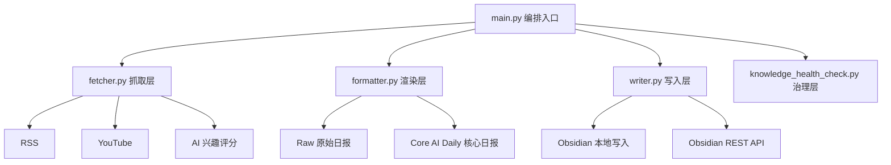

# Obsidian Workflow Open

> 面向 AI 高质量信息摄入的 Obsidian 本地优先（Local-First）知识工作流。
> 核心目标：把多源信息压缩成一份可读、可提炼、可沉淀的每日核心简报。

[](https://github.com/haoran3160-afk/pkm_obsidian_workflow/actions/workflows/ci.yml)
[](https://github.com/haoran3160-afk/pkm_obsidian_workflow/actions/workflows/docs.yml)
[](https://www.python.org/)
[](LICENSE)

---

## 项目定位

`obsidian_workflow_open` 不是单纯的资讯抓取脚本，而是一个可持续迭代的 PKM 工程流水线：

1. 多源采集：RSS、YouTube（可扩展）。
2. 质量过滤：AI 相关性评分 + 去重 + 限流。
3. 结构化输出：统一写入单一核心日报（默认）。
4. 知识治理：健康检查、结构一致性与可追溯来源。

当前版本已完全 AI-only（IELTS 相关内容与流程已移除）。

---

## 当前产出模式（重点）

默认开启：`daily_digest_only_output = true`

- 最终只产出一份核心日报：`30-Daily/AI-News/AI-Daily-YYYY-MM-DD.md`
- 不再默认生成 paper/video 独立笔记，避免信息过载
- 同一日报内统一包含：
  - AI 资讯
  - 推文速览
  - 工程实践
  - 论文雷达
  - 视频速览
- 并提供：
  - 今日精选（Top Picks）
  - 提炼任务（可执行）
  - Mermaid 知识图谱
  - 按来源快扫（折叠区）

如需恢复“论文/视频独立落地”，可将 `daily_digest_only_output` 设为 `false`。

---

## 工作流概览



---

## 快速开始

### 1) 环境要求

- Python 3.10+
- Obsidian
- （可选）Obsidian Local REST API 插件

### 2) 安装

```bash
git clone https://github.com/haoran3160-afk/pkm_obsidian_workflow.git
cd pkm_obsidian_workflow
pip install -r requirements.txt
```

### 3) 初始化配置

Unix/macOS:

```bash
cp .env.example .env
```

Windows PowerShell:

```powershell
Copy-Item .env.example .env
```

最少配置项：

```dotenv
OBSIDIAN_VAULT_PATH=D:/path/to/your/Obsidian
```

然后编辑 `pkm_config.json`（数据源与质量阈值）。

### 4) 预检

```bash
python main.py --doctor
```

### 5) 运行

```bash
# 正常执行（写入核心日报）
python main.py

# 只生成 Raw 原始日报（给 Agent/人工二次策展）
python main.py --raw-only

# 仅预览，不执行实际写入
python main.py --dry-run

# 测试模式（不写入 Vault）
python main.py --test

# 知识库健康检查
python main.py --health-check
```

---

## 关键配置项（pkm_config.json）

| 参数 | 作用 |
|---|---|
| `daily_digest_only_output` | 是否仅输出单一核心 AI Daily（推荐 `true`） |
| `daily_digest_top_picks` | 日报 Top Picks 数量上限 |
| `daily_digest_max_items_per_source` | 每来源最多展示条数（其余折叠） |
| `daily_digest_action_items` | 提炼任务条数 |
| `daily_digest_max_deferred_items` | 延后队列每类显示上限 |
| `daily_digest_include_mindmap` | 是否输出 Mermaid 思维导图 |
| `min_ai_interest_score` | AI 内容最低保留分数 |
| `max_ai_items_per_feed` | 限制单来源占比 |
| `max_paper_notes_per_day` | 每日纳入日报的论文条目上限 |
| `max_video_notes_per_day` | 每日纳入日报的视频条目上限 |
| `ai_interest_topics` | 中权重兴趣词 |
| `ai_priority_topics` | 高权重优先词 |
| `ai_exclude_keywords` | 降权噪声词 |
| `used_articles_retention_days` | 去重记忆窗口 |
| `source_health_keep_runs` | 来源健康历史保留轮次 |

### 数据源分类（content_type）

RSS 支持 `content_type` 字段，用于在核心日报中归类展示：

- `news`
- `tweet`
- `engineering`
- `paper`
- `video`
- `tooling`
- `community`
- `other`

示例：

```json
{
  "name": "OpenAI X (RSSHub Optional)",
  "url": "https://rsshub.app/twitter/user/OpenAI",
  "domain": "Tweet",
  "content_type": "tweet",
  "note_folder": "30-Daily/AI-News",
  "enabled": false
}
```

---

## 输出目录

- Raw 原始日报：`00-Inbox/Raw-Feeds/Raw-Daily-Feeds-YYYY-MM-DD.md`
- 核心日报：`30-Daily/AI-News/AI-Daily-YYYY-MM-DD.md`
- 健康检查报告：`40-MOC/lint-report-YYYY-MM-DD.md`

---

## 工程质量

本地建议执行：

```bash
pip install -r requirements-dev.txt
ruff check .
ruff format --check .
mypy main.py fetcher.py formatter.py writer.py config_schema.py --ignore-missing-imports
pytest --cov=. --cov-report=term-missing -q
```

---

## 文档入口

- [Quickstart](docs/quickstart.md)
- [Plugin Guide](docs/plugins.md)
- [Docs Index](docs/index.md)
- [Sample Outputs](docs/sample_outputs/ai-daily-brief-sample.md)

---

## 贡献

- 先阅读 [CONTRIBUTING.md](CONTRIBUTING.md)
- 使用 `.github` 下的 Issue/PR 模板提交问题与改动

---

## 许可证

MIT License，见 [LICENSE](LICENSE)