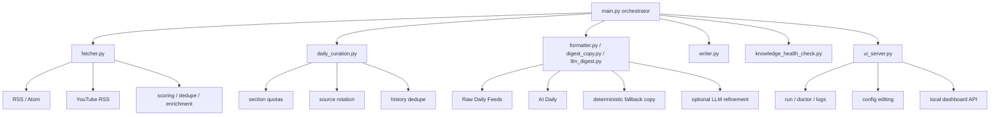

# PKM Obsidian Workflow

> 一个面向 AI 信息获取、策展、沉淀的 Obsidian 本地优先工作流。  
> 目标不是“抓更多”，而是每天稳定产出一份高信息密度、可执行、可回溯的 `AI Daily`。

[](https://github.com/haoran3160-afk/pkm_obsidian_workflow/actions/workflows/ci.yml)
[](https://github.com/haoran3160-afk/pkm_obsidian_workflow/actions/workflows/docs.yml)
[](https://www.python.org/)
[](LICENSE)

---

## 为什么做这个项目

大多数“信息流 -> 笔记”的自动化最后都会坏在三个地方：

1. 输入层很热闹，但真正有价值的信号被噪声淹没。
2. 总结层看起来很满，但没有形成可执行判断。
3. 沉淀层产出太碎，几天后连自己都不想回看。

`pkm_obsidian_workflow` 不是一个简单抓取器，而是一套**本地优先、证据优先、策展优先**的 AI 日报系统：

- 少而精：默认每天只产出一份核心 `AI Daily`
- 证据优先：先保留 raw，再做策展和摘要
- 可执行：最终日报必须能转成行动，而不是“知道了”
- 可治理：去重、来源轮换、健康检查、状态文件都内建在流程里

---

## 适合谁

- 用 Obsidian 做 PKM，希望把 AI 资讯沉淀进自己的 Vault
- 已经订阅很多 RSS / YouTube / arXiv，但每天筛选成本太高
- 想要“稳定日报系统”，而不是一次性新闻摘要
- 想要先跑本地 deterministic 流程，再按需启用 LLM 精修

---

## 核心能力

- RSS / Atom / YouTube RSS 抓取
- raw 证据流与 curated digest 双阶段输出
- 历史去重与来源轮换
- 论文 / 视频候选合并进每日 digest
- deterministic fallback copy
- 可选 LLM 文案精修层
- `disk` / `api` / `both` 三种写入方式
- 本地 FastAPI + React 控制面板
- `doctor` / `dry-run` / `health-check`

---

## 系统结构



---

## 目录结构

```text
obsidian_workflow_open/
├── .agent/workflows/                  # Agent workflow 模板
├── docs/                              # 项目文档与样例
├── templates/                         # Markdown 模板
├── tests/                             # Python 测试
├── ui/                                # 本地控制面板（React + Vite）
├── main.py                            # CLI / orchestrator
├── fetcher.py                         # 抓取、评分、去重、内容路由
├── daily_curation.py                  # 最终选题与状态管理
├── digest_copy.py                     # 稳定 fallback copy
├── llm_digest.py                      # 可选模型精修层
├── formatter.py                       # raw / curated Markdown 渲染
├── writer.py                          # disk / api 写入
├── ui_server.py                       # 本地 FastAPI 控制面板后端
├── config_schema.py                   # Pydantic 配置校验
├── state_schema.py                    # 状态文件 schema
├── knowledge_health_check.py          # Vault 健康检查
├── pkm_bridge.py                      # Obsidian REST API bridge
├── pkm_config.json                    # 主配置
├── package.json                       # 根级前端脚本
└── README.md
```

---

## 快速开始

### 路线 A：只用 CLI

```bash
git clone https://github.com/haoran3160-afk/pkm_obsidian_workflow.git
cd pkm_obsidian_workflow
pip install -r requirements.txt
```

复制环境模板：

- macOS / Linux: `cp .env.example .env`
- PowerShell: `Copy-Item .env.example .env`

最少只需要设置：

```dotenv
OBSIDIAN_VAULT_PATH=D:/path/to/your/Obsidian
```

然后执行：

```bash
python main.py --doctor --doctor-skip-network
python main.py --dry-run
python main.py
```

### 路线 B：启用本地控制面板

先完成 CLI 依赖安装，再补上前端依赖：

```bash
pip install -r requirements.txt
npm install
npm --prefix ui install
```

开发模式同时启动 API 和前端：

```bash
npm run dev:full
```

默认地址：

- UI: `http://127.0.0.1:5173`
- API: `http://127.0.0.1:8000`

---

## 常用命令

```bash
# 诊断环境与配置
python main.py --doctor

# 只看将要写入的结果
python main.py --dry-run

# 只生成 raw 证据流
python main.py --raw-only

# 测试模式，不写入 Vault
python main.py --test

# 生成最终日报
python main.py

# 生成 Vault 健康报告
python main.py --health-check
```

Runtime safety:

- `--dry-run` and `--test` do not persist feed cache, source health, source rotation, or used-article state.
- If no renderable candidates remain after fetch, dedupe, and curation, the workflow reports a skipped output instead of writing a frontmatter-only digest.

前端 / 本地控制面板：

```bash
npm run dev:api
npm run dev:ui
npm run dev:full
npm run build
npm run test:ui
```

---

## 控制面板能力

当前本地 UI MVP 包含 5 个页面：

- Dashboard：运行状态、Quick Run、最近输出、Feed Health、Live Log Stream
- Sources：RSS / YouTube 源启停与编辑
- Output：写入模式、Vault 路径、LLM 开关与核心 limits
- Logs：历史日志与实时事件流
- Settings：Doctor 触发与运行态检查

控制面板是**本地单用户工具**，默认只监听 `127.0.0.1`，不做公网暴露。

---

## HTTP API

本地控制面板后端暴露这些接口：

- `GET /api/status`
- `POST /api/run`
- `POST /api/doctor`
- `GET /api/logs/history`
- `GET /api/logs/stream`
- `GET /api/config/sources`
- `PUT /api/config/sources`
- `GET /api/config/output`
- `PUT /api/config/output`
- `POST /api/validate/vault`

详细说明见 [docs/api.md](docs/api.md)。

---

## 输出产物

默认写入：

- `00-Inbox/Raw-Feeds/Raw-Daily-Feeds-YYYY-MM-DD.md`
- `30-Daily/AI-News/AI-Daily-YYYY-MM-DD.md`
- `40-MOC/lint-report-YYYY-MM-DD.md`

样例与 walkthrough：

- [AI Daily Sample](docs/sample_outputs/ai-daily-brief-sample.md)
- [Paper Note Sample](docs/sample_outputs/paper-note-sample.md)
- [Video Note Sample](docs/sample_outputs/video-note-sample.md)
- [Workflow Walkthrough](docs/workthrough.md)
- [Local UI Guide](docs/local-ui.md)

---

## 配置重点

`pkm_config.json` 中最重要的参数：

| 参数 | 说明 |
|---|---|
| `daily_digest_only_output` | 是否只输出单一核心日报，推荐 `true` |
| `daily_digest_top_picks` | Top 区核心条目上限 |
| `daily_digest_max_items_per_source` | 每个来源展示上限 |
| `daily_digest_action_items` | action queue 条数 |
| `daily_digest_max_deferred_items` | deferred queue 条数 |
| `daily_digest_min_top_nonpaper` | Top 区最少非论文条数 |
| `daily_digest_min_top_content_types` | Top 区最少内容类型覆盖数 |
| `daily_digest_max_paper_in_top` | Top 区最多论文条数 |
| `min_ai_interest_score` | AI 内容最低保留分 |
| `max_ai_items_per_feed` | 单来源保留上限 |
| `max_paper_notes_per_day` | 每日论文笔记上限 |
| `max_video_notes_per_day` | 每日视频笔记上限 |

`.env` 里最重要的变量：

| 环境变量 | 说明 |
|---|---|
| `OBSIDIAN_VAULT_PATH` | Vault 路径 |
| `OBSIDIAN_API_BASE` | Obsidian Local REST API 地址 |
| `OBSIDIAN_API_KEY` | Obsidian Local REST API key |
| `PKM_ENABLE_LLM_DIGEST_COPY` | 是否启用最终文案精修层 |
| `OPENAI_API_KEY` | OpenAI API key |
| `PKM_CURATION_MODEL` | 文案精修模型 |
| `PKM_CURATION_REASONING_EFFORT` | 文案精修 reasoning 等级 |

---

## 工程质量门禁

开发依赖安装：

```bash
pip install -r requirements-dev.txt
```

推荐门禁顺序：

```bash
python -m pytest -q
python -m ruff check .
python -m mypy main.py fetcher.py formatter.py writer.py config_schema.py pkm_bridge.py state_schema.py ui_server.py llm_digest.py daily_curation.py digest_copy.py
npm run build
npm run test:ui
python main.py --doctor --doctor-skip-network
python main.py --dry-run
```

---

## 给 Agent 的提示词

把下面这段提示词交给你的 Agent。它的目标不是“抓到什么就拼成日报”，而是尽量贴近这个仓库的本地工作流约束：

```text
你现在是这个仓库的日报策展 Agent，不是“抓取后顺手总结一下”的摘要器。

你的目标：
1. 先保留 raw 证据，再做最终策展。
2. 输出结果要尽量接近 Obsidian 本地工作流，而不是自由发挥。
3. 日报必须高信息密度、少空话、能转成行动。

强约束：
1. 每次开始前，先读取 used_articles.json 和 source_rotation.json。
2. 已被 used_articles.json 记录过的 URL，不得再次入选。
3. 优先使用最近 4 天未被选中过的来源，避免同源刷屏。
4. 如果本周还没使用过 3Blue1Brown，则“今日视频”优先给它。
5. Top 1-3 优先来自 AI 主新闻、工程实践、工作流与评测更新，不要默认塞论文。
6. 创投洞见、洞见、今日视频、AI 公司洞见都必须按固定栏目输出。
7. 没有足够证据时可以写“未披露”，但绝不允许编造数字、发布时间、性能结论或商业结构。
8. 输出必须包含来源、原文链接、核心概念、深度 Takeaways 或简报要点、行动启示。

工作顺序：
1. 运行 Raw 流，保留当天原始证据。
2. 读取状态文件，执行历史去重和来源轮换。
3. 按栏目配额选题，不要只按分数排序。
4. 先用 deterministic copy 产出稳定日报。
5. 如果显式开启了 LLM 精修层，再对最终 copy 做语言层润色；不得让模型参与改写选题事实。
6. 成功写入后，更新 used_articles.json 和 source_rotation.json。

成功标准：
- 日报结构稳定。
- 来源分布健康。
- 每个栏目都能读出“这条信息为什么重要”和“接下来该做什么”。
- 即使没有外部模型，也能输出完整、可读、可信的日报。
```

---

## 路线图

- 更强的多源去重与主题聚合
- 更稳的原文抽取与全文增强
- 周报 / 月报自动汇总
- 从日报 action items 自动升级长期笔记
- 更完整的插件生态与第三方数据源接入

---

## License

MIT
