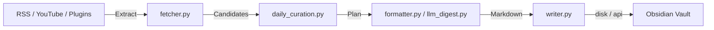

---
hide:
  - toc
---

# PKM Obsidian Workflow

> 本地优先的 AI 日报工作流，把抓取、筛选、策展、写入放进一个可复现的 Obsidian 流程。

这个项目不是“多抓一点 RSS”，而是“每天稳定生成一份值得看的 AI 日报”。

默认产出两层内容：

- `Raw Daily Feeds`：保留原始证据，方便 Agent 或人工二次策展。
- `AI Daily`：按固定栏目输出一份高信息密度日报，而不是散乱的碎片笔记。

- :fontawesome-solid-bolt: **[Quickstart](quickstart.md)**  
  从安装、配置到首个日报产出，最短路径跑通。

- :fontawesome-solid-wand-magic-sparkles: **[Workflow Walkthrough](workthrough.md)**  
  了解抓取层、策展层和最终日报是怎么串起来的。

- :fontawesome-solid-puzzle-piece: **[Source Plugins](plugins.md)**  
  扩展抓取器，接入你自己的 Reddit、API 或内部信息源。

- :fontawesome-solid-file-lines: **[AI Daily Sample](sample_outputs/ai-daily-brief-sample.md)**  
  查看最终日报结构和写作风格示例。

- :fontawesome-solid-book-open: **[Paper Note Sample](sample_outputs/paper-note-sample.md)**  
  查看论文条目的独立笔记格式。

- :fontawesome-solid-video: **[Video Note Sample](sample_outputs/video-note-sample.md)**  
  查看视频类条目的落地格式。

## Architecture

## Features at a Glance

| Feature | Status |
|---------|--------|
| RSS / Atom feed parsing | Yes |
| YouTube via RSS | Yes |
| Raw capture mode | Yes |
| Local-parity curated digest | Yes |
| Pydantic config validation | Yes |
| Write mode: `disk` / `api` / `both` | Yes |
| `--dry-run` and `--doctor` | Yes |
| Source plugin registry | Yes |
| Structured logging | Yes |
| GitHub Actions CI | Yes |
| Daily scheduler | Yes |
