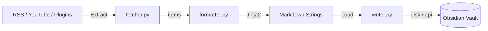

---
hide:
  - toc
---

# Obsidian PKM Workflow

> **Your Local, AI-Ready Second Brain Pipeline.**

An automated PKM workflow that streams RSS feeds, arXiv papers, and YouTube videos directly into your Obsidian Vault as pristine Markdown — with zero cloud dependency.

- :fontawesome-solid-bolt: **[Quickstart](quickstart.md)**  
  Zero to your first fetch in 5 minutes.

- :fontawesome-solid-gear: **[Configuration](configuration.md)**  
  Customize feeds, YouTube channels, and write mode.

- :fontawesome-solid-puzzle-piece: **[Plugins](plugins.md)**  
  Add Reddit, Twitter, or any custom data source.

- :fontawesome-solid-file-code: **[Templates](templates.md)**  
  Customize Jinja2 templates to match your PKM taxonomy.

- :fontawesome-solid-terminal: **[CLI Reference](cli.md)**  
  All command-line flags explained.

- :material-hand-heart: **[Contributing](contributing.md)**  
  How to contribute to the project.

## Architecture

## Features at a Glance

| Feature | Status |
|---------|--------|
| RSS / Atom Feed Parsing | ✅ |
| YouTube via RSS | ✅ |
| Network retry (exponential backoff) | ✅ |
| Jinja2 Note Templates | ✅ |
| Pydantic Config Validation | ✅ |
| Write Mode: disk / api / both | ✅ |
| `--dry-run` mode | ✅ |
| Source Plugin Registry | ✅ |
| Rich Terminal Summaries | ✅ |
| Structured Logging (structlog) | ✅ |
| GitHub Actions CI | ✅ |
| Daily Scheduler | ✅ |
