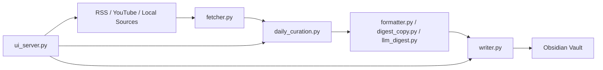

---
hide:
  - toc
---

# PKM Obsidian Workflow

本项目把 AI 资讯抓取、候选筛选、最终策展和 Vault 写入放进一条**本地优先**的 Obsidian 工作流。

默认产出两层内容：

- `Raw Daily Feeds`：保留当天原始证据流
- `AI Daily`：按固定栏目输出一份可读、可执行、可回溯的每日 digest

它不是“抓更多 feed”，而是“每天稳定得到一份值得读的 AI 日报”。

- :fontawesome-solid-bolt: **[Quickstart](quickstart.md)**  
  从安装、配置到第一次 dry-run，最短路径跑通。

- :fontawesome-solid-display: **[Local UI Guide](local-ui.md)**  
  使用本地控制面板管理 sources、output、logs 和 quick run。

- :fontawesome-solid-code: **[HTTP API](api.md)**  
  查看本地 FastAPI 接口、请求体和调用方式。

- :fontawesome-solid-wand-magic-sparkles: **[Workflow Walkthrough](workthrough.md)**  
  理解抓取层、策展层、状态文件与最终日报如何衔接。

- :fontawesome-solid-puzzle-piece: **[Source Plugins](plugins.md)**  
  扩展抓取层，接入 Reddit、API 或你自己的内部源。

- :fontawesome-solid-file-lines: **[AI Daily Sample](sample_outputs/ai-daily-brief-sample.md)**  
  查看最终日报的结构和输出风格。

## Architecture

## Release Surface

| Surface | Status |
|---|---|
| CLI workflow | Yes |
| `--doctor` / `--dry-run` / `--raw-only` | Yes |
| Deterministic digest fallback | Yes |
| Optional LLM copy layer | Yes |
| Local FastAPI control plane | Yes |
| React/Vite local dashboard | Yes |
| Pydantic config + state schema | Yes |
| Pytest + Ruff + Mypy + UI tests | Yes |
