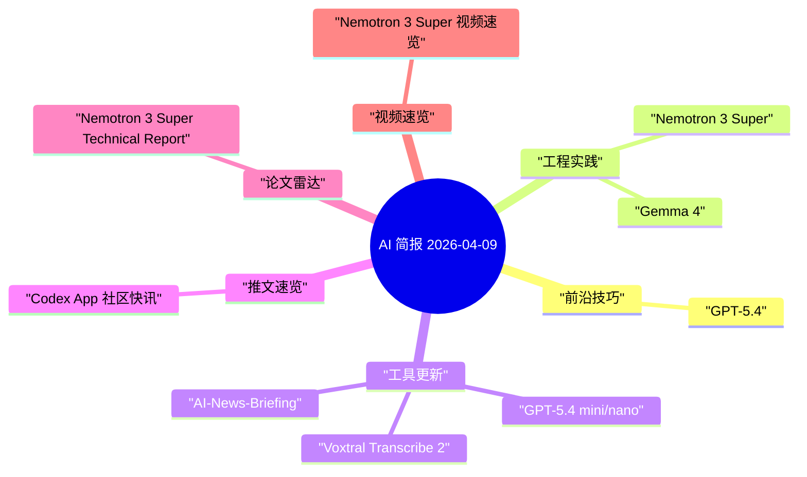

# AI 每日简报 - 2026-04-09

> [!summary] 60 秒快读
> - 今日精选：**6** 条
> - 扫描来源：**9** 个
> - 覆盖类型：推文 **1**、工程实践 **3**、论文 **1**、视频 **1**
> - 输出形态：**单一核心 AI Daily**
> - 建议阅读顺序：速读摘要 -> 今日精选 -> 统一雷达 -> 提炼任务

## 阅读路径
- `60 秒`：速读摘要 + 前 3 条今日精选
- `10 分钟`：+ 统一雷达 + 提炼任务
- `30 分钟`：+ 知识图谱 + 按来源快扫

> [!info] 单日报模式
> 本次仅写入一份核心日报，不再额外生成论文/视频独立笔记。

## Karpathy 视角：今日认知增量

> [!tip] 认知评估框架
> - 能力边界是否实质前移（不仅是榜单数字）？
> - 架构范式是否变化（例如主模型+子代理）？
> - 成本-延迟-质量前沿是否改写？
> - 评测与治理是否可复现、可审计？
> - 能否沉淀为长期杠杆（SOP/模板/基线）？

### 判断 1：能力边界正在转向“专业工作产出”
- 证据：[Introducing GPT-5.4](https://openai.com/index/introducing-gpt-5-4/)（OpenAI 官方）
- 发生了什么：GPT-5.4 把重点从“会答题”推进到“能交付工作结果”，在 GDPval 与 OSWorld-Verified 这类更贴近真实任务的评测上继续上探。
- 为什么重要：这意味着模型选择要从“单一 benchmark 排名”升级到“任务闭环能力 + 工具协同能力 + 成本效率”三维评估。
- 今日动作：把你当前最核心的 1 个知识工作流改成可评测脚本，建立 A/B 对照基线。

### 判断 2：小模型子代理成为默认架构
- 证据：[Introducing GPT-5.4 mini and nano](https://openai.com/index/introducing-gpt-5-4-mini-and-nano/)（OpenAI 官方）
- 发生了什么：官方明确强调 mini/nano 在高吞吐、低延迟、低成本子任务中的定位，并支持大上下文与工具调用。
- 为什么重要：系统架构应从“单模型全包”转向“主模型规划 + 子模型并行执行”，把预算花在真正需要高推理强度的节点上。
- 今日动作：把你的日报生产链路拆成“主代理 + 2 类子代理”，分别负责检索和结构化抽取。

### 判断 3：开源模型竞争点转向“可部署 + 可复现 + 可治理”
- 证据：[Gemma 4](https://blog.google/innovation-and-ai/technology/developers-tools/gemma-4/) / [Nemotron 3 Super](https://developer.nvidia.com/blog/introducing-nemotron-3-super-an-open-hybrid-mamba-transformer-moe-for-agentic-reasoning/)
- 发生了什么：Google 与 NVIDIA 都在强调 agentic workflow、长上下文、部署路径和评测可复现，而不只是参数规模。
- 为什么重要：对工程团队而言，真正护城河是“上线速度 + 运维稳定性 + 评测闭环”，不是单次模型首发。
- 今日动作：把“模型替换”改成标准化 SOP：评测集合、成本阈值、回滚条件一次写清。

## 今日精选

### 1. [Introducing GPT-5.4](https://openai.com/index/introducing-gpt-5-4/)
`来源: OpenAI 官方博客` | `类型: AI 资讯` | `分桶: 前沿技巧` | `兴趣分: 10` | `发布时间: 2026-03-10`
- 事实快照：官方强调 GPT-5.4 在专业知识工作、工具协同与 token 效率上的综合提升，并给出多组评测对比。
- 为什么值得看：这是“模型能力 -> 业务可交付”的直接信号，关系到你是否需要重构当前工作流编排策略。
- 今天怎么用：提炼 1 个新技巧 + 1 个关键权衡。
- 关键证据信号：priority:coding agent, priority:evaluation, practical:+

### 2. [Introducing GPT-5.4 mini and nano](https://openai.com/index/introducing-gpt-5-4-mini-and-nano/)
`来源: OpenAI 官方博客` | `类型: AI 资讯` | `分桶: 工具更新` | `兴趣分: 9` | `发布时间: 2026-03-17`
- 事实快照：mini/nano 聚焦低延迟与低成本，强调在编码子任务、工具调用和大规模并发场景中的效率优势。
- 为什么值得看：对子代理体系非常关键，直接影响你的吞吐与成本上限。
- 今天怎么用：提炼迁移影响与工具选型标准。
- 关键证据信号：priority:coding agent, priority:tool calling, practical:+

### 3. [Gemma 4: Our most capable open models to date](https://blog.google/innovation-and-ai/technology/developers-tools/gemma-4/)
`来源: Google AI Blog` | `类型: AI 资讯` | `分桶: 工程实践` | `兴趣分: 9` | `发布时间: 2026-04-02`
- 事实快照：Gemma 4 提供多档模型并采用 Apache 2.0 许可，强调函数调用、结构化输出、长上下文和 agentic workflows。
- 为什么值得看：这是“开源模型可生产化”路线的代表，适合评估本地优先方案的上限。
- 今天怎么用：提炼 1 个本周可验证的流程步骤。
- 关键证据信号：priority:open models, interest:workflow, practical:+

### 4. [Voxtral Transcribe 2](https://mistral.ai/news/voxtral-transcribe-2)
`来源: Mistral AI News` | `类型: AI 资讯` | `分桶: 工具更新` | `兴趣分: 8` | `发布时间: 2026-03-31`
- 事实快照：Voxtral Transcribe 2 覆盖 batch 和 realtime 两类语音转写，强调低延迟、低 WER、多语言与开放权重部署能力。
- 为什么值得看：语音输入已成为 Agent 交互的重要入口，这类模型直接决定语音链路可用性与成本。
- 今天怎么用：提炼迁移影响与工具选型标准。
- 关键证据信号：priority:voice agent, practical:+

### 5. [Introducing Nemotron 3 Super](https://developer.nvidia.com/blog/introducing-nemotron-3-super-an-open-hybrid-mamba-transformer-moe-for-agentic-reasoning/)
`来源: NVIDIA Technical Blog` | `类型: AI 资讯` | `分桶: 工程实践` | `兴趣分: 8` | `发布时间: 2026-03-18`
- 事实快照：NVIDIA 公布混合 Mamba-Transformer MoE 路线，并同时提供权重、部署入口和公开评测 recipe。
- 为什么值得看：把“模型发布”升级为“可复现工程资产”，更适合作为企业验证起点。
- 今天怎么用：提炼 1 个本周可验证的流程步骤。
- 关键证据信号：interest:inference, priority:open models, practical:+

### 6. [AI-News-Briefing](https://github.com/hoangsonww/AI-News-Briefing)
`来源: GitHub 工程实践` | `类型: 工程实践` | `分桶: 工具更新` | `兴趣分: 8` | `发布时间: 2026-04-09`
- 事实快照：该项目把资讯研究拆成并行发现、深挖验证、综合写作、发布四阶段，并强调 citation 与日期完整性。
- 为什么值得看：它把“新闻摘要”提升为“可审计情报流程”，适合直接借鉴到你的 PKM 生产线。
- 今天怎么用：提炼迁移影响与工具选型标准。
- 关键证据信号：priority:workflow, practical:+

## 统一雷达

### AI 资讯
- [GPT-5.4](https://openai.com/index/introducing-gpt-5-4/) | 来源: OpenAI 官方博客 | 兴趣分: 10 | 专业工作能力与工具协同能力继续提升。
- [GPT-5.4 mini/nano](https://openai.com/index/introducing-gpt-5-4-mini-and-nano/) | 来源: OpenAI 官方博客 | 兴趣分: 9 | 子代理场景的效率模型。
- ...另有 3 条

### 推文速览
- [Codex App 个性化主题（社区快讯）](https://x.com/OpenAIDevs/status/2032222631538409728) | 来源: X / OpenAIDevs | 兴趣分: 6 | 社区信号，建议二次核验官方 changelog。

### 工程实践
- [AI-News-Briefing](https://github.com/hoangsonww/AI-News-Briefing) | 来源: GitHub | 兴趣分: 8 | 多代理并行研究 + 引用可追溯。
- [ai-daily-skill](https://github.com/geekjourneyx/ai-daily-skill) | 来源: GitHub | 兴趣分: 7 | 标准化日报模板，适合自动生成与二次策展。
- ...另有 1 条

### 论文雷达
- [Nemotron 3 Super Technical Report](https://research.nvidia.com/publication/2026-03_nemotron-3-super) | 来源: NVIDIA Research | 兴趣分: 7 | 可用于建立本地评测基线。

### 视频速览
- [NVIDIA Launches Nemotron 3 Super](https://www.youtube.com/watch?v=lmqxqf0cqX4) | 来源: YouTube | 兴趣分: 6 | 适合快速了解产品叙事，技术细节以官方文档为准。

## 提炼任务（可执行）

- [ ] 1. 为你当前的 `AI Daily` 流程建立 1 组评测集：准确性、可执行性、重复率。
- [ ] 2. 把“主模型 + 子代理”拆分方案落到配置层，记录每一步成本和延迟。
- [ ] 3. 选择 1 个开源模型方案（Gemma 4 或 Nemotron）做最小 PoC，对比闭源 API 方案。

## 知识图谱

## 按来源快扫

<strong>OpenAI 官方博客</strong>（共 2 条，展示 2 条）

- [Introducing GPT-5.4](https://openai.com/index/introducing-gpt-5-4/) (兴趣分 10; 前沿技巧)
- [Introducing GPT-5.4 mini and nano](https://openai.com/index/introducing-gpt-5-4-mini-and-nano/) (兴趣分 9; 工具更新)

<strong>Google AI Blog</strong>（共 1 条，展示 1 条）

- [Gemma 4: Our most capable open models to date](https://blog.google/innovation-and-ai/technology/developers-tools/gemma-4/) (兴趣分 9; 工程实践)

<strong>NVIDIA Technical Blog / Research</strong>（共 2 条，展示 2 条）

- [Introducing Nemotron 3 Super](https://developer.nvidia.com/blog/introducing-nemotron-3-super-an-open-hybrid-mamba-transformer-moe-for-agentic-reasoning/) (兴趣分 8; 工程实践)
- [Nemotron 3 Super Technical Report](https://research.nvidia.com/publication/2026-03_nemotron-3-super) (兴趣分 7; 前沿技巧)

