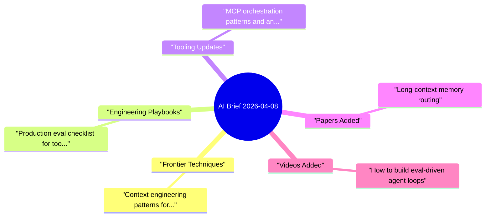

# AI Daily Brief - 2026-04-08

> [!summary] Fast Lane (60s)
> - Top picks: **3**
> - Sources scanned: **2**
> - Notes written: Papers **1**, Videos **1**
> - Suggested order: TL;DR -> Top Picks -> Distill Queue

## Read Paths
- `60s skim`: TL;DR + first 3 Top Picks
- `10m standard`: + Distill Queue + Added Today
- `30m deep`: + Mindmap + Quick Scan by Source

## Top Picks

### 1. [Context engineering patterns for coding agents](https://example.com/context-engineering)
`source: OpenAI News` | `bucket: Frontier Techniques` | `score: 10`
- Why it matters: Actionable for building or hardening coding-agent workflows.
- Summary: A practical breakdown of context windows, memory handoff, and eval gates in agent pipelines.
- Signals: priority:context engineering, priority:coding agent, practical:+
- Capture prompt: Capture 1 new technique and 1 tradeoff.

### 2. [Production eval checklist for tool-calling systems](https://example.com/eval-checklist)
`source: OpenAI News` | `bucket: Engineering Playbooks` | `score: 9`
- Why it matters: Useful for setting up evaluation loops and quality gates.
- Summary: Covers regression metrics, failure buckets, and release criteria for tool-use agents.
- Signals: priority:evaluation, priority:tool calling, practical:+
- Capture prompt: Capture 1 workflow step you can test this week.

### 3. [MCP orchestration patterns and anti-patterns](https://example.com/mcp-patterns)
`source: LangChain Blog` | `bucket: Tooling Updates` | `score: 8`
- Why it matters: Contains practical implementation detail you can apply quickly.
- Summary: Explains connector isolation, retries, timeout budget, and observability tradeoffs.
- Signals: interest:workflow, practical:+
- Capture prompt: Capture migration impact and tool choice criteria.

## Distill Queue (CODE)

- [ ] 1. [Context engineering patterns for coding agents](https://example.com/context-engineering) | Capture 1 new technique and 1 tradeoff.
- [ ] 2. [Production eval checklist for tool-calling systems](https://example.com/eval-checklist) | Capture 1 workflow step you can test this week.
- [ ] 3. [MCP orchestration patterns and anti-patterns](https://example.com/mcp-patterns) | Capture migration impact and tool choice criteria.

## Knowledge Map

## Papers Added Today

- [[2026-04-08-long-context-memory-routing]] | Source: arXiv cs.AI | TL;DR: Proposes a routing strategy that separates short-term task context and durable memory.

## Videos Added Today

- [[2026-04-08-Andrej-Karpathy-how-to-build-eval-driven-agent-loops]] | Source: Andrej Karpathy | TL;DR: Shows a lightweight eval harness for iteration speed without losing reliability.

## Deferred Queue (showing up to 6 per type)

### Papers
- [Deferred: retrieval stress testing](https://example.com/deferred-retrieval) | Papers With Code | Benchmark notes for retrieval robustness under noisy context.

## Quick Scan by Source

<strong>OpenAI News</strong> (2 items, showing 2)

- [Context engineering patterns for coding agents](https://example.com/context-engineering) (score 10; Frontier Techniques) - A practical breakdown of context windows, memory handoff, and eval gates in agent pipelines.
- [Production eval checklist for tool-calling systems](https://example.com/eval-checklist) (score 9; Engineering Playbooks) - Covers regression metrics, failure buckets, and release criteria for tool-use agents.

<strong>LangChain Blog</strong> (1 items, showing 1)

- [MCP orchestration patterns and anti-patterns](https://example.com/mcp-patterns) (score 8; Tooling Updates) - Explains connector isolation, retries, timeout budget, and observability tradeoffs.

