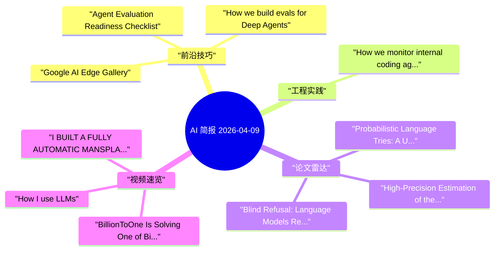

# AI 每日简报 - 2026-04-09

> [!summary] 60 秒快读
> - 今日精选：**5** 条
> - 扫描来源：**25** 个
> - 覆盖类型：推文 **0**、工程实践 **4**、论文 **4**、视频 **3**
> - 输出形态：**单一核心 AI Daily**
> - 阅读结构：TL;DR -> 关键结论 -> 分栏简报 -> 执行清单

> [!info] 单日报模式
> 本次仅写入一份核心日报，不再额外生成论文/视频独立笔记。

## 今日 TL;DR（Tier 1）

- How we monitor internal coding agents for misalignment：英文原文聚焦AI 核心议题、编码代理、可落地实现，对应「产品化节奏与落地窗口」维度；建议：提炼 1 个本周可验证的流程步骤。（OpenAI News (Optional)，2026-03-19）
- Agent Evaluation Readiness Checklist：英文原文聚焦AI 核心议题、评测体系、评测实践，对应「能力边界与研究方向」维度；建议：提炼 1 个新技巧 + 1 个关键权衡。（LangChain Blog (Optional)，2026-03-27）
- How we build evals for Deep Agents：英文原文聚焦AI 核心议题、评测体系、评测实践，对应「能力边界与研究方向」维度；建议：提炼 1 个新技巧 + 1 个关键权衡。（LangChain Blog (Optional)，2026-03-26）
- Google AI Edge Gallery：英文原文聚焦AI 核心议题、工具调用、skill，对应「能力边界与研究方向」维度；建议：提炼 1 个新技巧 + 1 个关键权衡。（Simon Willison (Engineering Practice Optional)，2026-04-06）
- Announcing the LangChain + MongoDB Partnership: The AI Agent Stack That Runs...：英文原文聚焦AI 核心议题、记忆机制、可落地实现，对应「能力边界与研究方向」维度；建议：提炼 1 个新技巧 + 1 个关键权衡。（LangChain Blog (Optional)，2026-03-31）
- Probabilistic Language Tries: A Unified Framework for Compression, Decision P...：英文原文聚焦论文雷达动态，对应「能力边界与研究方向」维度；建议：提炼 1 个本周可验证的流程步骤。（arXiv cs.LG，2026-04-09）

## Karpathy 视角：今日认知增量

> [!tip] 认知评估框架
> - 能力边界是否实质前移（不仅是榜单数字）？
> - 架构范式是否变化（例如主模型+子代理）？
> - 成本-延迟-质量前沿是否改写？
> - 评测与治理是否可复现、可审计？
> - 能否沉淀为长期杠杆（SOP/模板/基线）？

### 判断 1：产品化节奏与落地窗口
- 证据：[How we monitor internal coding agents for misalignment](https://openai.com/index/how-we-monitor-internal-coding-agents-misalignment)（OpenAI News (Optional) / AI 资讯 / 2026-03-19）
- 发生了什么：英文原文聚焦AI 核心议题、编码代理、可落地实现，对应「产品化节奏与落地窗口」维度；建议：提炼 1 个本周可验证的流程步骤。
- 为什么重要：可直接用于搭建或加固 Coding Agent 工作流。
- 今日动作：提炼 1 条本周可验证动作，写入任务清单并设定完成标准。

### 判断 2：能力边界与研究方向
- 证据：[Agent Evaluation Readiness Checklist](https://blog.langchain.com/agent-evaluation-readiness-checklist/)（LangChain Blog (Optional) / 工程实践 / 2026-03-27）
- 发生了什么：英文原文聚焦AI 核心议题、评测体系、评测实践，对应「能力边界与研究方向」维度；建议：提炼 1 个新技巧 + 1 个关键权衡。
- 为什么重要：有助于建立评测闭环和质量闸口。
- 今日动作：把其中 1 个新能力做成最小复现实验，记录失败边界与可迁移条件。

### 判断 3：能力边界与研究方向
- 证据：[How we build evals for Deep Agents](https://blog.langchain.com/how-we-build-evals-for-deep-agents/)（LangChain Blog (Optional) / 工程实践 / 2026-03-26）
- 发生了什么：英文原文聚焦AI 核心议题、评测体系、评测实践，对应「能力边界与研究方向」维度；建议：提炼 1 个新技巧 + 1 个关键权衡。
- 为什么重要：有助于建立评测闭环和质量闸口。
- 今日动作：把其中 1 个新能力做成最小复现实验，记录失败边界与可迁移条件。

## 关键结论（Takeaways）

| 主题 | 关键变化 | 影响判断 | 今日动作 |
|---|---|---|---|
| 产品化节奏与落地窗口 | 英文原文聚焦AI 核心议题、编码代理、可落地实现，对应「产品化节奏与落地窗口」维度；建议：提炼 1 个本周可验证的流程步骤。 | 可直接用于搭建或加固 Coding Agent 工作流。 | 提炼 1 条本周可验证动作，写入任务清单并设定完成标准。 |
| 能力边界与研究方向 | 英文原文聚焦AI 核心议题、评测体系、评测实践，对应「能力边界与研究方向」维度；建议：提炼 1 个新技巧 + 1 个关键权衡。 | 有助于建立评测闭环和质量闸口。 | 把其中 1 个新能力做成最小复现实验，记录失败边界与可迁移条件。 |
| 能力边界与研究方向 | 英文原文聚焦AI 核心议题、评测体系、评测实践，对应「能力边界与研究方向」维度；建议：提炼 1 个新技巧 + 1 个关键权衡。 | 有助于建立评测闭环和质量闸口。 | 把其中 1 个新能力做成最小复现实验，记录失败边界与可迁移条件。 |

## 分栏简报（Tier 2）

### AI 资讯
> 共 **1** 条；主要来源：OpenAI News (Optional)。
- [How we monitor internal coding agents for misalignment](https://openai.com/index/how-we-monitor-internal-coding-agents-misalignment) — 英文原文聚焦AI 核心议题、编码代理、可落地实现，对应「产品化节奏与落地窗口」维度；建议：提炼 1 个本周可验证的流程步骤。（来源：OpenAI News (Optional)；日期：2026-03-19；兴趣分：7）

### 工程实践
> 共 **4** 条；主要来源：LangChain Blog (Optional) / Simon Willison (Engineering Practice Optional)。
- [Agent Evaluation Readiness Checklist](https://blog.langchain.com/agent-evaluation-readiness-checklist/) — 英文原文聚焦AI 核心议题、评测体系、评测实践，对应「能力边界与研究方向」维度；建议：提炼 1 个新技巧 + 1 个关键权衡。（来源：LangChain Blog (Optional)；日期：2026-03-27；兴趣分：12）
- [Google AI Edge Gallery](https://simonwillison.net/2026/Apr/6/google-ai-edge-gallery/#atom-everything) — 英文原文聚焦AI 核心议题、工具调用、skill，对应「能力边界与研究方向」维度；建议：提炼 1 个新技巧 + 1 个关键权衡。（来源：Simon Willison (Engineering Practice Optional)；日期：2026-04-06；兴趣分：11）
- [How we build evals for Deep Agents](https://blog.langchain.com/how-we-build-evals-for-deep-agents/) — 英文原文聚焦AI 核心议题、评测体系、评测实践，对应「能力边界与研究方向」维度；建议：提炼 1 个新技巧 + 1 个关键权衡。（来源：LangChain Blog (Optional)；日期：2026-03-26；兴趣分：11）
- [Announcing the LangChain + MongoDB Partnership: The AI Agent Stack That Runs On The Database You Already Trust](https://blog.langchain.com/announcing-the-langchain-mongodb-partnership-the-ai-agent-stack-that-runs-on-the-database-you-already-trust/) — 英文原文聚焦AI 核心议题、记忆机制、可落地实现，对应「能力边界与研究方向」维度；建议：提炼 1 个新技巧 + 1 个关键权衡。（来源：LangChain Blog (Optional)；日期：2026-03-31；兴趣分：8）

### 论文雷达
> 共 **4** 条；主要来源：arXiv cs.LG / arXiv cs.AI。
- [Probabilistic Language Tries: A Unified Framework for Compression, Decision Policies, and Execution Reuse](https://arxiv.org/abs/2604.06228) — 英文原文聚焦论文雷达动态，对应「能力边界与研究方向」维度；建议：提炼 1 个本周可验证的流程步骤。（来源：arXiv cs.LG；日期：2026-04-09）
- [High-Precision Estimation of the State-Space Complexity of Shogi via the Monte Carlo Method](https://arxiv.org/abs/2604.06189) — 英文原文聚焦论文雷达动态，对应「能力边界与研究方向」维度；建议：提炼 1 个本周可验证的流程步骤。（来源：arXiv cs.AI；日期：2026-04-09）
- [Blind Refusal: Language Models Refuse to Help Users Evade Unjust, Absurd, and Illegitimate Rules](https://arxiv.org/abs/2604.06233) — 英文原文聚焦论文雷达动态，对应「能力边界与研究方向」维度；建议：提炼 1 个本周可验证的流程步骤。（来源：arXiv cs.AI；日期：2026-04-09）
- [A Benchmark of Classical and Deep Learning Models for Agricultural Commodity Price Forecasting on A Novel B...](https://arxiv.org/abs/2604.06227) — 英文原文聚焦论文雷达动态，对应「能力边界与研究方向」维度；建议：提炼 1 个本周可验证的流程步骤。（来源：arXiv cs.LG；日期：2026-04-09）

### 视频速览
> 共 **3** 条；主要来源：Y Combinator / Yannic Kilcher。
- [BillionToOne Is Solving One of Biotech’s Hardest Problems](https://www.youtube.com/watch?v=kkv5rZhrLkc) — 英文原文聚焦视频速览动态，对应「心智模型与学习路径」维度；建议：提炼 1 个本周可验证的流程步骤。（来源：Y Combinator；日期：2026-04-06）
- [I BUILT A FULLY AUTOMATIC MANSPLAINER](https://www.youtube.com/watch?v=xHi8PUIVyoo) — 英文原文聚焦视频速览动态，对应「心智模型与学习路径」维度；建议：提炼 1 个本周可验证的流程步骤。（来源：Yannic Kilcher；日期：2026-03-06）
- [How I use LLMs](https://www.youtube.com/watch?v=EWvNQjAaOHw) — 英文原文聚焦视频速览动态，对应「心智模型与学习路径」维度；建议：提炼 1 个本周可验证的流程步骤。（来源：Andrej Karpathy；日期：2025-02-27）

## 可执行清单（Action Queue）

- [ ] 1. [How we monitor internal coding agents for misalignment](https://openai.com/index/how-we-monitor-internal-coding-agents-misalignment) | 提炼 1 个本周可验证的流程步骤。
- [ ] 2. [Agent Evaluation Readiness Checklist](https://blog.langchain.com/agent-evaluation-readiness-checklist/) | 提炼 1 个新技巧 + 1 个关键权衡。
- [ ] 3. [How we build evals for Deep Agents](https://blog.langchain.com/how-we-build-evals-for-deep-agents/) | 提炼 1 个新技巧 + 1 个关键权衡。

## 知识图谱

## 延后队列（每类最多展示 6 条）

### 论文
- [Toward Reducing Unproductive Container Moves: Predicting Service Requirements and Dwell Times](https://arxiv.org/abs/2604.06251) | arXiv cs.AI | 英文原文聚焦论文雷达动态，对应「能力边界与研究方向」维度；建议：提炼 1 个本周可验证的流程步骤。
- [Weakly Supervised Distillation of Hallucination Signals into Transformer Representations](https://arxiv.org/abs/2604.06277) | arXiv cs.AI | 英文原文聚焦论文雷达动态，对应「能力边界与研究方向」维度；建议：提炼 1 个本周可验证的流程步骤。
- [SymptomWise: A Deterministic Reasoning Layer for Reliable and Efficient AI Systems](https://arxiv.org/abs/2604.06375) | arXiv cs.AI | 英文原文聚焦论文雷达动态，对应「能力边界与研究方向」维度；建议：提炼 1 个本周可验证的流程步骤。
- [SELFDOUBT: Uncertainty Quantification for Reasoning LLMs via the Hedge-to-Verify Ratio](https://arxiv.org/abs/2604.06389) | arXiv cs.AI | 英文原文聚焦论文雷达动态，对应「能力边界与研究方向」维度；建议：提炼 1 个本周可验证的流程步骤。
- [Qualixar OS: A Universal Operating System for AI Agent Orchestration](https://arxiv.org/abs/2604.06392) | arXiv cs.AI | 英文原文聚焦论文雷达动态，对应「能力边界与研究方向」维度；建议：提炼 1 个本周可验证的流程步骤。
- [ProofSketcher: Hybrid LLM + Lightweight Proof Checker for Reliable Math/Logic Reasoning](https://arxiv.org/abs/2604.06401) | arXiv cs.AI | 英文原文聚焦论文雷达动态，对应「能力边界与研究方向」维度；建议：提炼 1 个本周可验证的流程步骤。

### 视频
- [This Startup Catches Fraud at Scale](https://www.youtube.com/watch?v=JF6XIixstmQ) | Y Combinator | 英文原文聚焦视频速览动态，对应「心智模型与学习路径」维度；建议：提炼 1 个本周可验证的流程步骤。
- [" It is very possible that the first people to live to a thousand are alive right now."](https://www.youtube.com/shorts/Afp90LAaXNw) | Y Combinator | 英文原文聚焦视频速览动态，对应「心智模型与学习路径」维度；建议：提炼 1 个本周可验证的流程步骤。
- [Deep Dive into LLMs like ChatGPT](https://www.youtube.com/watch?v=7xTGNNLPyMI) | Andrej Karpathy | 英文原文聚焦视频速览动态，对应「心智模型与学习路径」维度；建议：提炼 1 个本周可验证的流程步骤。
- [Let's reproduce GPT-2 (124M)](https://www.youtube.com/watch?v=l8pRSuU81PU) | Andrej Karpathy | 英文原文聚焦视频速览动态，对应「心智模型与学习路径」维度；建议：提炼 1 个本周可验证的流程步骤。
- [Traditional X-Mas Stream](https://www.youtube.com/watch?v=Dr6jw-WAd9E) | Yannic Kilcher | 英文原文聚焦视频速览动态，对应「心智模型与学习路径」维度；建议：提炼 1 个本周可验证的流程步骤。
- [Traditional Holiday Live Stream](https://www.youtube.com/watch?v=DNajvkqfobY) | Yannic Kilcher | 英文原文聚焦视频速览动态，对应「心智模型与学习路径」维度；建议：提炼 1 个本周可验证的流程步骤。

## 证据来源（Top Sources）

[OpenAI News (Optional)](https://openai.com/index/how-we-monitor-internal-coding-agents-misalignment) | [LangChain Blog (Optio...](https://blog.langchain.com/agent-evaluation-readiness-checklist/) | [LangChain Blog (Optio...](https://blog.langchain.com/how-we-build-evals-for-deep-agents/) | [Simon Willison (Engin...](https://simonwillison.net/2026/Apr/6/google-ai-edge-gallery/#atom-everything) | [LangChain Blog (Optio...](https://blog.langchain.com/announcing-the-langchain-mongodb-partnership-the-ai-agent-stack-that-runs-on-the-database-you-already-trust/) | [arXiv cs.LG](https://arxiv.org/abs/2604.06228) | [arXiv cs.AI](https://arxiv.org/abs/2604.06189) | [arXiv cs.AI](https://arxiv.org/abs/2604.06233)

## 关键词

#AI资讯 #工程实践 #论文雷达 #视频速览 #baseai #codingagent #前沿技巧 #evaluation #toolcalling #memory

## 快速统计

- 来源总数：**25**
- Top Picks：**5**
- 类型覆盖：AI资讯 1 / 推文 0 / 工程 4 / 论文 4 / 视频 3
- 主要来源分布：LangChain Blog (Optional)(3)、arXiv cs.AI(2)、arXiv cs.LG(2)

## 按来源快扫（高密度）

<strong>LangChain Blog (Optional)</strong>（共 3 条，展示 2 条）

- [Agent Evaluation Readiness Checklist](https://blog.langchain.com/agent-evaluation-readiness-checklist/) (兴趣分 12; 前沿技巧) - 英文原文聚焦AI 核心议题、评测体系、评测实践，对应「能力边界与研究方向」维度；建议：提炼 1 个新技巧 + 1 个关键权衡。
- [How we build evals for Deep Agents](https://blog.langchain.com/how-we-build-evals-for-deep-agents/) (兴趣分 11; 前沿技巧) - 英文原文聚焦AI 核心议题、评测体系、评测实践，对应「能力边界与研究方向」维度；建议：提炼 1 个新技巧 + 1 个关键权衡。
- ...另有 1 条

<strong>arXiv cs.AI</strong>（共 2 条，展示 2 条）

- [High-Precision Estimation of the State-Space Complexity of Shogi via the Monte Carlo Method](https://arxiv.org/abs/2604.06189) - 英文原文聚焦论文雷达动态，对应「能力边界与研究方向」维度；建议：提炼 1 个本周可验证的流程步骤。
- [Blind Refusal: Language Models Refuse to Help Users Evade Unjust, Absurd, and Illegitimate Rules](https://arxiv.org/abs/2604.06233) - 英文原文聚焦论文雷达动态，对应「能力边界与研究方向」维度；建议：提炼 1 个本周可验证的流程步骤。

<strong>arXiv cs.LG</strong>（共 2 条，展示 2 条）

- [A Benchmark of Classical and Deep Learning Models for Agricultural Commodity Price Forecasting on A Novel Bangladeshi Market Price Dataset](https://arxiv.org/abs/2604.06227) - 英文原文聚焦论文雷达动态，对应「能力边界与研究方向」维度；建议：提炼 1 个本周可验证的流程步骤。
- [Probabilistic Language Tries: A Unified Framework for Compression, Decision Policies, and Execution Reuse](https://arxiv.org/abs/2604.06228) - 英文原文聚焦论文雷达动态，对应「能力边界与研究方向」维度；建议：提炼 1 个本周可验证的流程步骤。

<strong>OpenAI News (Optional)</strong>（共 1 条，展示 1 条）

- [How we monitor internal coding agents for misalignment](https://openai.com/index/how-we-monitor-internal-coding-agents-misalignment) (兴趣分 7; 工程实践) - 英文原文聚焦AI 核心议题、编码代理、可落地实现，对应「产品化节奏与落地窗口」维度；建议：提炼 1 个本周可验证的流程步骤。

<strong>Simon Willison (Engineering Practice Optional)</strong>（共 1 条，展示 1 条）

- [Google AI Edge Gallery](https://simonwillison.net/2026/Apr/6/google-ai-edge-gallery/#atom-everything) (兴趣分 11; 前沿技巧) - 英文原文聚焦AI 核心议题、工具调用、skill，对应「能力边界与研究方向」维度；建议：提炼 1 个新技巧 + 1 个关键权衡。

<strong>Y Combinator</strong>（共 1 条，展示 1 条）

- [BillionToOne Is Solving One of Biotech’s Hardest Problems](https://www.youtube.com/watch?v=kkv5rZhrLkc) - 英文原文聚焦视频速览动态，对应「心智模型与学习路径」维度；建议：提炼 1 个本周可验证的流程步骤。

<strong>Andrej Karpathy</strong>（共 1 条，展示 1 条）

- [How I use LLMs](https://www.youtube.com/watch?v=EWvNQjAaOHw) - 英文原文聚焦视频速览动态，对应「心智模型与学习路径」维度；建议：提炼 1 个本周可验证的流程步骤。

<strong>Yannic Kilcher</strong>（共 1 条，展示 1 条）

- [I BUILT A FULLY AUTOMATIC MANSPLAINER](https://www.youtube.com/watch?v=xHi8PUIVyoo) - 英文原文聚焦视频速览动态，对应「心智模型与学习路径」维度；建议：提炼 1 个本周可验证的流程步骤。

