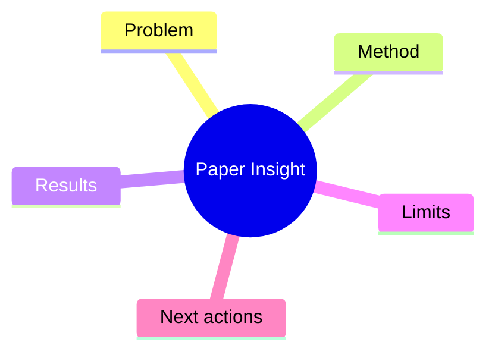

# Efficient Agent Memory Graphs

> [!summary] TL;DR
> Introduces a graph-based memory indexing method for long-running coding agents.

## Quick Capture

- One-sentence thesis:
- Why this matters to current work:
- Confidence (1-5):

## Reading Questions

- [ ] What is the core claim?
- [ ] What evidence is strongest?
- [ ] What can be tested this week?

## Structure Map

## Claim -> Evidence -> Implication

| Claim | Evidence | Implication |
| --- | --- | --- |
|  |  |  |

## Key Contributions

> *(to be filled after reading)*

## My Notes

> *(to be filled)*

## Source

- [Original Paper](https://arxiv.org/abs/2604.00001)