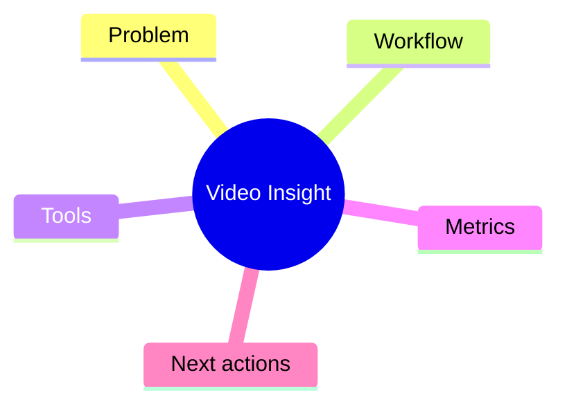

# Tool Calling in Production: What Breaks First

> [!info] Source
> Channel: **AI Engineer** | Date: 2026-04-08  
> [Watch Video](https://youtube.com/watch?v=toolcalling-prod)

> [!summary] TL;DR
> A concise tour of common tool-calling failures and mitigation patterns.

## Watch Goals

- [ ] What is the main framework?
- [ ] What can be applied in my workflow today?
- [ ] Which idea should become a permanent note?

## Concept Map

## Key Takeaways

> *(fill in after watching)*

## Distilled Notes

> *(to be filled)*

## Action Items

- [ ] Add one permanent note
- [ ] Link this note into one MOC/project page