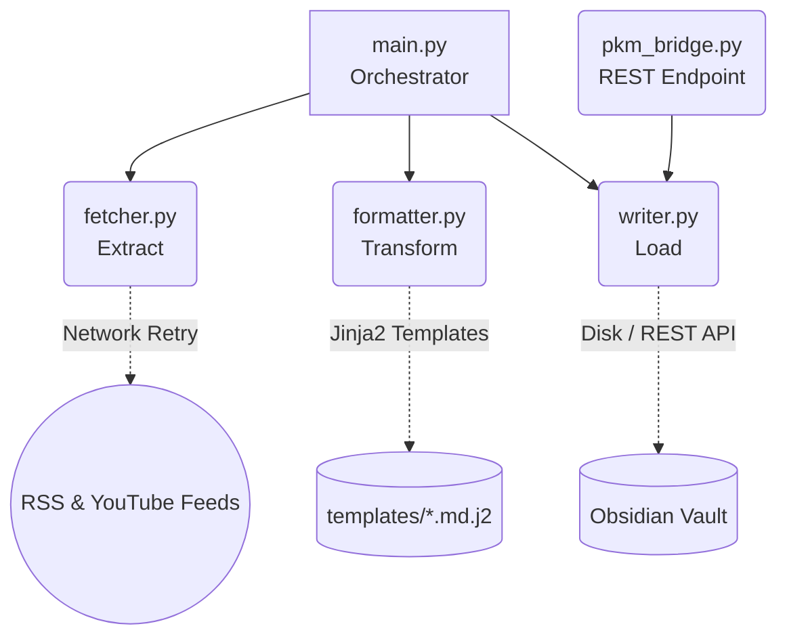

# Obsidian PKM Workflow

> **Your Local, AI-Ready Second Brain Pipeline.**

An automated Personal Knowledge Management (PKM) workflow script that aggregates daily news, AI research papers, and YouTube videos, routing them directly into your Obsidian Vault as pristine Markdown.

## Why use this project?

1. 🧠 **Your Offline Information Copilot**: Break free from "information scattering" anxiety. Build a high-signal, zero-code pipeline that streams RSS and YouTube directly into your PKM system.
2. 🤖 **An Agent-Ready Skeleton**: Purpose-built for the AI era. Natively supports generating "Raw Data Feeds" specifically designed to be easily processed by Dify, Coze, or local LLMs. Spend your time *connecting* knowledge, not *moving* it.
3. 🔒 **100% Data Sovereignty**: No expensive cloud services. No closed-source databases. All your fetched data rests safely as Markdown files in your local Obsidian Vault. Private, secure, and future-proof.
4. 🏗️ **Template-Driven Framework**: Obsidian workflows are highly personal. This framework delegates all Markdown styling to `Jinja2` templates. You have complete control over how your Notes, Tags, and Frontmatter look.

---

## 🏗️ Architecture Stack

The project relies on a strict ETL (Extract, Transform, Load) separation to ensure robustness and easy extensibility.



- **`fetcher.py`**: Handles external network requests with exponential backoff (`tenacity`) to ensure stability.
- **`formatter.py`**: A pure transformation layer powered by Jinja2 templates. Decouples Python code from Markdown view logic.
- **`writer.py`**: Centralized storage I/O. Safe handling of either direct file system drops or Obsidian Local REST API calls.

## 🚀 Getting Started

### Prerequisites
- **Python 3.8+**
- **Obsidian** (and the [Obsidian Local REST API Plugin](https://github.com/coddingtonbear/obsidian-local-rest-api) if you are bridging data via `pkm_bridge.py`)

### 1. Installation

```bash
git clone https://github.com/yourusername/obsidian_workflow.git
cd obsidian_workflow/pkm_workflow

# Install the dependencies
pip install -r requirements.txt
```

### 2. Configuration

Copy the example environment variables file and fill in your absolute Vault path:
```bash
cp .env.example .env
```
*(Optionally tweak `pkm_config.json` to define which RSS feeds and YouTube channels you care about!)*


### 3. Usage

**Immediate Fetch**  
Fetch today's feeds directly into your Vault:
```bash
python main.py
```

**Daemon / Scheduled Mode**  
Keep the script running in the background to automatically trigger daily pulling:
```bash
python main.py --schedule
```

**AI Agent Mode (Raw Extract)**  
Export raw feeds to a temporary Markdown Inbox for an AI Agent to curate, avoiding permanent unread clutter:
```bash
python main.py --raw-only
```

---

## 🛠️ Modifying the Note Templates

Don't like our default frontmatter tags? Head over to the `/templates` folder. 
Every output file is backed by a simple `Jinja2` template. Just edit the Markdown inside `.md.j2` and the script will honor your personal PKM taxonomy.

## 🤝 Contributing
Contributions are highly welcome. Please refer to [CONTRIBUTING.md](CONTRIBUTING.md) for guidelines on ensuring your Pull Requests adhere to the decoupled ETL pattern.

## ⚖️ License
MIT License.
